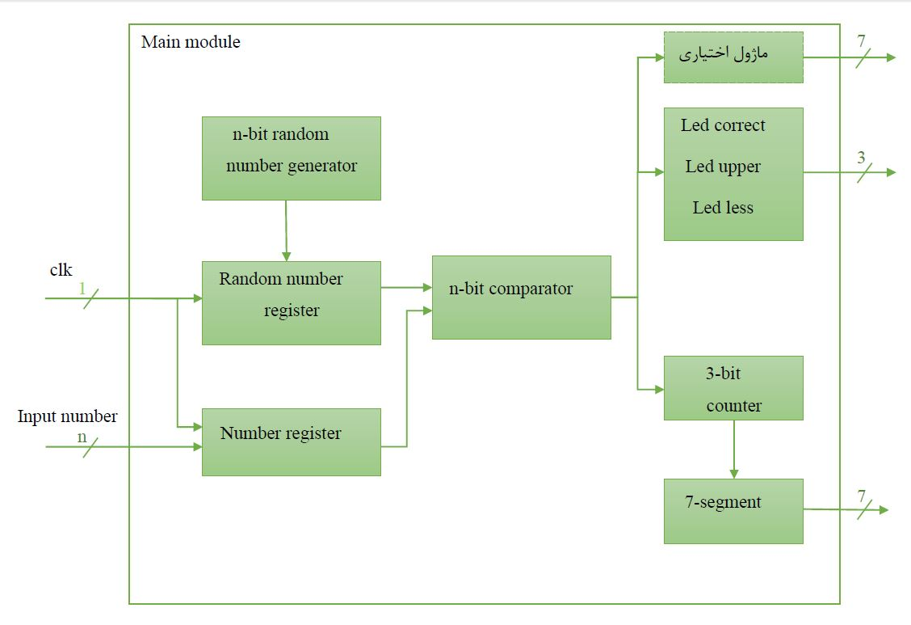

# Gomaan

The circuit of a number guessing game 

with VHDL code

DLD (Digital Logic Design) course at [Buali Sina university of Hamedan](https://basu.ac.ir)

contributors: [Amir Mahdi Rezaee Tavana](https://github.com/amirtavana117) ,[Mohammad Moradi](https://github.com/itismoradi)
